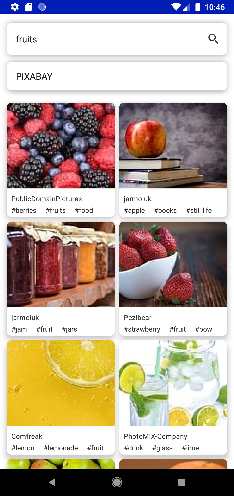
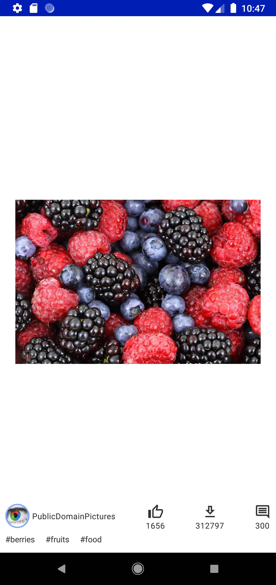

# StockImageApp

## Add the api-key's for each image platform:

Add the apiKey for each image platform to the corresponding property inside the `gradle.properties`

1. Pixabay api-key to `api_key_pixabay="<api-key-pixabay>"`
1. Pexels api-key to `api_key_pexels="<api-key-pexels>"`

## Build with:

- [Coil](https://github.com/coil-kt)
- [Room](https://developer.android.com/jetpack/androidx/releases/room)
- [Hilt](http://google.github.io/hilt/)
- [Timber](https://github.com/JakeWharton/timber)
- [Kotlin Flows](https://kotlinlang.org/docs/reference/coroutines/flow.html)
- [Material Design](https://material.io/blog/android-material-theme-color)
- [Jetpack Compose](https://developer.android.com/jetpack/compose?)
- [Retrofit & OkHttp](https://github.com/square/retrofit)
- [Navigation component](https://developer.android.com/guide/navigation)

## Architecture:

- MVVM Pattern
- Repository Pattern
- Finite state machine pattern
